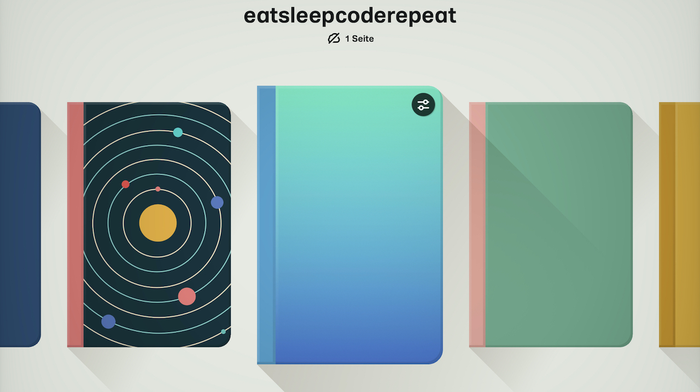
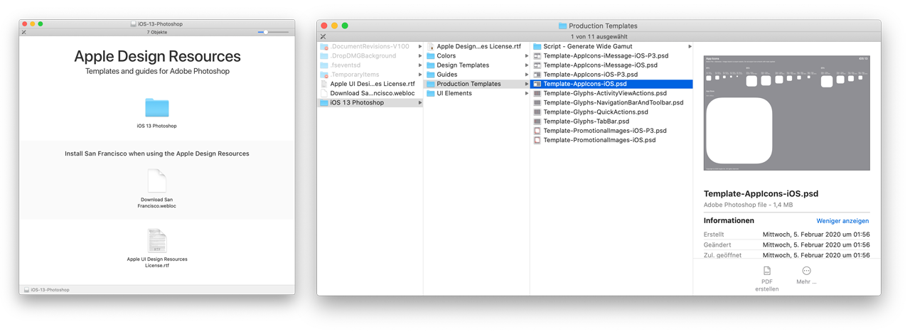
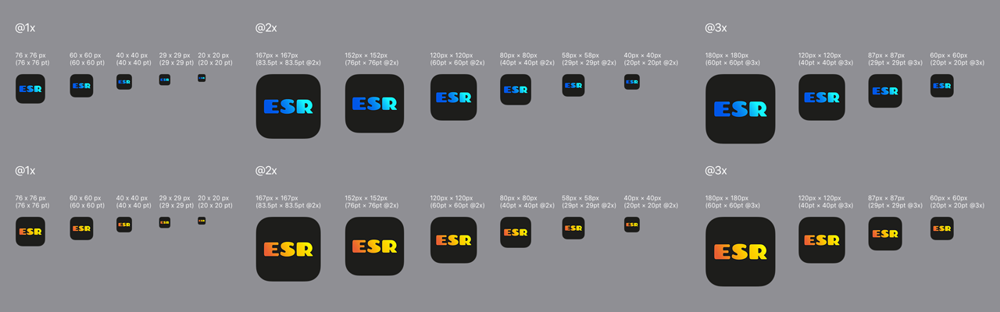
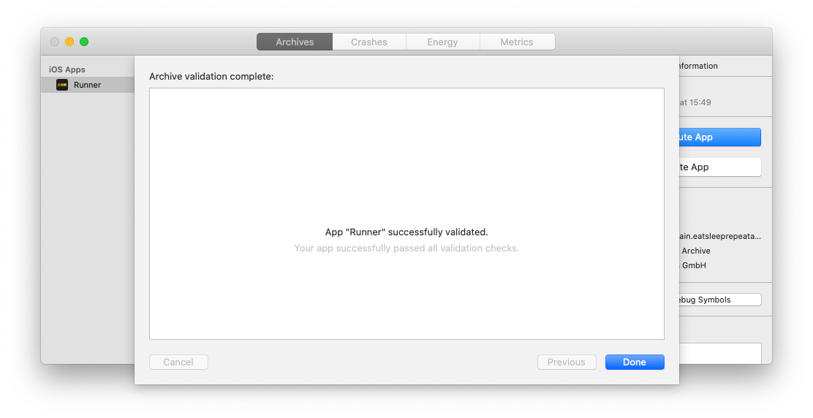

# 100 Days Of Code - Log

## Day 0.0 - 15. July 2020

I am starting with a couple of zero days, since I go on vacation in August and the notebook doesn't come along ;) So the real challenge will start end of August.

### Preparation for the #100DaysOfCode challenge. 

The challenge includes several projects:
- todo app (flutter firebase & sqlite)
- Work Life Balance app (flutter moor)
- simple flutter time tracking app
- ESCR (motivation flutter app)

> Thats quite a scope, but X preparation days plus 100 days means 150 to 300 hours... We'll see what's possible.

### Additional tasks:
- Design
- UX
- Platform specific behaviors and guidelines
- Setup Apple Store
- Data Privacy
- Internationalization

#### While preparing my flutter sdk, playground and projects, i found a Flutter Version Management package
I'll have a ['spike'](https://en.wikipedia.org/wiki/Spike_(software_development)) on this later in the 100 days of flutter coding.

https://pub.dev/packages/fvm  
https://github.com/flutter/flutter/wiki/Flutter-build-release-channels  
https://flutter.dev/docs/development/tools/sdk/releases  

#### Some inspirations 
[Flutter UI Tutorial | Login and Signup Page Design & Animation - day 23](https://www.youtube.com/watch?v=Hq7Wj6DshNs&list=PLf-j0Hs0PF3u5WSVX_x3GzU0sAP6oIwA5&index=23)  
https://github.com/erluxman/awesomefluttertips  
https://www.hackingwithswift.com/100/swiftui  
https://mobile.twitter.com/search?q=100DaysOfCode%20flutter&src=typed_query

#### Today's Progress:
Started project txtty with desktop macOS enabled. Installed [supercharged](http://pub.dev/packages/) which only works iOS, Android and web (but who knows... until user story 'parse_chat_messages', this could change). Added simple BottomNavigationBar with 3 empty views (dashboard, chats, settings).

#### Thoughts:
Thought i could use a shortcut with [settings_ui](https://pub.dev/packages/settings_ui) - but this package supports only iOS and Android.

> The example of settings_ui uses [device_preview](https://pub.dev/packages/device_preview) - **that's a todo for the user story 'flutter and responsive layout'**.

In my ESCR project i use the [shared_preferences_settings](https://pub.dev/packages/shared_preferences_settings) package, which supports web. But i think there was a textColor issue with my dark theme. I'll check this later, when i am working on that project.

> ToFigureOut - How much additional time will it cost, to log the 100 days?

#### Link to work ...

## Day 0.1 - 16. July 2020

#### Today's Progress:
Lost in state management. Cloned and tested so many different flutter architecture examples. Read and watched countless tutorials. I am confused.

#### Links:
https://flutter.dev/docs/development/data-and-backend/state-mgmt/options  
https://flutter.dev/docs/development/data-and-backend/state-mgmt/simple  
https://github.com/rrousselGit/provider  
https://resocoder.com/2020/04/09/flutter-state-management-tutorial-provider-changenotifier-bloc-mobx-more/  
https://resocoder.com/2019/10/26/flutter-bloc-library-tutorial-1-0-0-stable-reactive-state-management/  
https://bloclibrary.dev/#/fluttertodostutorial  
https://bloclibrary.dev/#/flutterfirestoretodostutorial  
https://github.com/felangel/bloc/tree/master/examples  
https://www.youtube.com/watch?v=knMvKPKBzGE  
https://pub.dev/packages/hydrated_bloc  
https://www.youtube.com/watch?v=vSOpZd_FFEY  
https://www.raywenderlich.com/4074597-getting-started-with-the-bloc-pattern  
https://medium.com/flutter-community/making-sense-all-of-those-flutter-providers-e842e18f45dd  
https://www.raywenderlich.com/6373413-state-management-with-provider  
https://www.filledstacks.com/post/flutter-state-management-with-stacked/  
https://github.com/FilledStacks/stacked-example/tree/master  
https://riverpod.dev (experimental provider rewrite)  
https://mobx.netlify.app/getting-started  
https://github.com/mobxjs/mobx.dart  
https://github.com/mobxjs/mobx.dart/blob/master/mobx_examples/lib/todos/todo_widgets.dart  
https://www.youtube.com/watch?v=hio1Avj5lOg  
https://www.youtube.com/watch?v=8j7W91ZJuV0  
https://circleci.com/blog/state-management-for-flutter-apps-with-mobx/  

#### Thoughts:
I think this basic research takes more time than i thought.

#### Link(s) to work...

> **Highlight:** Add a PageStorageKey to your list for maintaining the position. Found at [filledstacks](https://www.filledstacks.com/post/bottom-navigation-with-stacked-architecture/). 


## Day 0.2 - 17. July 2020

#### Today's Progress:
Found [flutter get/getx](https://pub.dev/packages/get) package, which looks very promising. Created a new playground for only moor, state management and firebase.

Playing again with moor code/examples. Upgraded the [ResoCoder/flutter-moor-tutorial](https://github.com/ResoCoder/flutter-moor-tutorial) to moor_flutter: ^3.1.0 (this example uses MultiProvider and DAOs).

The [flutter moor todo example from Rody Davis](https://github.com/rodydavis/moor_shared) uses rxdart and 'blocs'.

#### Links flutter moor:
https://moor.simonbinder.eu/docs/getting-started/  
https://github.com/simolus3/moor/tree/master/moor_flutter/example  
https://resocoder.com/2019/07/17/moor-room-for-flutter-3-foreign-keys-joins-migrations-fluent-sqlite-database/  

#### Links Get/GetX:
[Amateur Coder - Complete GetX State Management](https://www.youtube.com/watch?v=CNpXbeI_slw)  
https://github.com/jonataslaw/getx  
https://github.com/tadaspetra/getx_examples  
https://pub.dev/documentation/get/latest/  
https://github.com/loicgeek/todo_getx  
https://medium.com/@loicgeek/flutter-how-to-create-a-todo-app-using-firebase-firestore-and-firebase-authentication-with-getx-6a9265ca5f00  

#### Thoughts:
Routing with GetX looks so easy. And i'll fixed some null problems in the todo_getx code to run it on the Simulator. All in all a good day with more flutter moor findings.

#### Todo:
- https://github.com/kauemurakami/getx_snippets_extension  
https://github.com/kauemurakami/getx_pattern  
https://www.youtube.com/watch?v=RaqPIoJSTtI  

#### ToLookAtLater:
[Deploying App to the App Store](https://www.youtube.com/watch?v=NT-W5sAarco)  
https://github.com/cybdom/storage_manager  
https://www.raywenderlich.com/10794904-internationalizing-and-localizing-your-flutter-app

#### Todays Takeaway:
[flutter pub upgrade](https://flutter.dev/docs/development/tools/sdk/upgrading#upgrading-packages) solved some wired multi_headers.dart:97:8: Error...  
pod install solved as well an error 

#### Link(s) to work...

> **Highlight:** Found this flutter moor ['issue'](https://github.com/simolus3/moor/issues/151) which leads to a really [nice moor shopping cart gist](https://github.com/simolus3/moor/issues/151)

## Day 0.3 - 18. July 2020

#### Today's Progress:
Forked #100DaysOfCode. Moved and converted the content from my blog post to this log  
Created 'journals' for each project in Paper App  



First look at the eatsleepcoderepeat code. So alpha... that has to be a fresh start with some steps from

> The optional not-so-optional steps that flutter doesn't mention when creating your project.
https://dash-overflow.net/articles/getting_started/

#### Thoughts:
Feels demanding to switch between the projects. I hope this is the 'project cleanup/setup phase'.

#### ToDo:
- Create new eatsleepcoderepeat flutter project  
- Record times for logging

## Day 0.4 - 19. July 2020

#### Today's Progress:
Created new flutter project. Checked my ['dart settings'](https://dartcode.org/docs/recommended-settings/) in vscode. Used (regex) search and replace ```//.*``` to remove the flutter main.dart boilerplate comments.

Implemented [analysis_options.yaml](https://github.com/flutter/flutter/blob/master/analysis_options.yaml) which was one step from [Rémi Rousselets article](https://dash-overflow.net/articles/getting_started/). The linting step is a later todo.

Played with [json](https://flutter.dev/docs/development/data-and-backend/json) and [shared_preferences](https://pub.dev/packages/shared_preferences)

Moved and fixed first code from old project to eat_sleep_repeat.

#### Thoughts:
Renamed project to eat_sleep_repeat. The code part is too specific for an app name but was really a lifesaver during the past few months.

From [shared_preferences](https://pub.dev/packages/shared_preferences): There is no guarantee that writes will be persisted to disk after returning, so this plugin must not be used for storing critical data.

Not critical, but a bad user experience, if the stored  'motivations' are lost.

So there is a todo, maybe the [localstorage package](https://pub.dev/packages/localstorage/) will solve this. 

#### Links:
https://medium.com/better-programming/flutter-how-to-save-objects-in-sharedpreferences-b7880d0ee2e4  
https://codingwithjoe.com/flutter-saving-and-restoring-with-sharedpreferences/

#### ToDo:
- Test the [localstorage package](https://pub.dev/packages/localstorage/)  
- Fix wired output [link](https://stackoverflow.com/questions/55399209/update-flutter-dependencies-in-pub-cache)

#### Todays Takeaway:
Enabled [flutter-ui-guides](https://dartcode.org/releases/v3-1/#preview-flutter-ui-guides) (restart vscode) and installed [pubspec-assist](https://marketplace.visualstudio.com/items?itemName=jeroen-meijer.pubspec-assist) this could be very useful. Less pub.dev search package and copy to pubspec.yaml


## Day 0.5 - 20. July 2020

#### Today's Progress:
Implemented a drawer. Found after i watched a [talk](https://youtu.be/FCyoHclCqc8) from the flutter europe conference 2020. [drawer_challenge](https://github.com/MarcinusX/drawer_challenge)

Added 'GetX' and implemented first controller for the logic stuff.

Played with sliders (link below)

#### Thoughts:
I'll have to reduce the features for step 1. Remembered the agile [skateboard](https://m.dotdev.co/the-agile-bicycle-829a83b18e7) 

#### Links:
https://pub.dev/packages/flutter_xlider/  
https://fidev.io/complex-ui/

#### ToDo:
- Use/Test [get_storage](https://pub.dev/packages/get_storage) for step 1 instead of shared_preferences or the localstorage package

## Day 0.6 - 21. July 2020

#### Today's Progress:
Fixed 'disable onDoubleTap' in HomeView if drawer is open. Removed sliders. Implemented get_storage to 'observe' the TextField value onChange and save it.

#### Thoughts:
Lost in GetX. It's late. Let go and start fresh tomorrow.

#### ToDo:
- Use a model with 'word', 'xcord','ycord' etc.

#### Todays Takeaway:
Always a good idea to 'inspect' the used widget (see highlight;)

> **Highlight:**
There is a maxLength for TextField...

## Day 0.7 - 22. July 2020

#### Today's Progress:
A first alpha version is ready. Took much too long. Struggled with CustomPainter and my RxSetting model. Code is still to cleanup and refactor.

#### Thoughts:
I am looking forward to use GetX with firebase or flutter_moor. 

#### ToDo:
- Cleanup/refactor code. Add initial '-> swipe' word/content when app is installed.  
- Create new App Icon, add App Icon and Splashscreen.  
- Add little 'help' to explain the input and the double click 'action'.  
- A little 'close' icon int he drawer.

#### Todays Takeaway:
```
final Random _random = Random();
int next(int min, int max) => min + _random.nextInt(max - min);
```
> **Highlight:**
App is ready to run on my iPhone.

## Day 0.8 - 23. July 2020

#### Today's Progress:
Created first quick draft of the app icon with the [Google Font Chango](https://fonts.google.com/specimen/Chango). Added [.ai](assets/app-icon/app-icon-1024-template.ai) and [.psd](assets/app-icon/app-icon-1024-template.psd) templates to this assets folder.

Downloaded the Photoshop Download from [Apples Human Interface Guidelines](https://developer.apple.com/design/resources/) ~ 500 MB

There is a Template-AppIcons-iOS.psd which gives an idea for the proportions of your app icon.




After broken builds (provision profile something) and a reboot of my MacBook and the iPhone, i was able to build the app on my iPhone. There are 42 warnings... for the deleted shared_preferences, Setter for 'isStatusBarHidden' was deprecated..., Initialization of variable 'flutter_native_splash' was never used... [explanation](https://github.com/matwright/AnimalFarmRevisionApp/issues/36) which links to the [flutter build modes](https://flutter.dev/docs/testing/build-modes).

Inspected the app 'tree' with [devtools](https://stackoverflow.com/questions/53381536/how-to-use-flutters-widget-inspector-in-visual-studio-code) because on the iPhone there was a thin white line when the drawer was open.

For this simple project i use a constant darkColor. Next project will have a theme folder with colors and text definitions... 

Played with focusNode and [SingleChildScrollView](https://api.flutter.dev/flutter/widgets/SingleChildScrollView-class.html)

Watched yesterday after last commit some youtube videos for App Store deployment.

#### Thoughts:
There is always 'some time' that is not calc

#### Links:
https://pub.dev/packages/animated_text_kit  
https://www.youtube.com/watch?v=YPLs3xrDcm0 (Deployment iOS - CodeWithChris)  
https://www.youtube.com/watch?v=NFTaWkUtD34 (Deploy Google Play Store - Amateur Coder)  
https://www.youtube.com/watch?v=NT-W5sAarco (Deploy Apple App Store - Amateur Coder)  
https://www.youtube.com/watch?v=o2KveVr7adg (ConstrainedBox)  
https://api.flutter.dev/flutter/widgets/SingleChildScrollView-class.html  
https://flutter.dev/docs/cookbook/forms/focus

#### ToDo:
- Implement more Google Fonts with random font on doubleTap.  
- Read about deployment https://flutter.dev/docs/deployment/ios
- repaint Textholder after changing the device orientation
- save finishedTutorial in box(storage), so that it only shows after first open drawer.

#### ToLookAtLater:
https://web.dev/variable-fonts/  
https://pub.dev/packages/draggable_scrollbar  
https://medium.com/zipper-studios/the-keyboard-causes-the-bottom-overflowed-error-5da150a1c660  
https://pub.dev/packages/keyboard_avoider  

> **Highlight:**
The app 'runs' on my iPhone.


## Day 0.9 - 24. July 2020

#### Today's Progress:
Fine tuning paddings for portrait and landscape. Removing iPad/Tablet version from scope in step 1. Cleaned open Browser tabs from yesterdays session.

Added a finishedTutorial bool to storage and a saveFinishedTutorial to the controller. Which is no longer a SettingsController. I am not happy with that name. I'll have to split this into more controller.

Playing with fontFamily. At first i finished the implementation of the [Raleway and RoboMono font](https://flutter.dev/docs/cookbook/design/fonts). But after endless copy/paste/edit the weight and style of each font in the pubspec.yaml i remembered the [google_fonts](https://pub.dev/packages/google_fonts) package.

At the bottom of that page you find a topic on [Licensing Fonts](https://pub.dev/packages/google_fonts#licensing-fonts) which leeds to the [LicenseRegistry class](https://api.flutter.dev/flutter/foundation/LicenseRegistry-class.html) and [LicensePage class](https://api.flutter.dev/flutter/material/LicensePage-class.html) - that is a todo!

You can call GoogleFonts.getFont('Lato') but i was not able to pass a font name like bungeeShade, bungee_Shade, Bungee_Shade, BungeeShade. So i was 'limited' to one word fonts ;)

Found an error in my random position calculation, that uses the TextField value.length. Turns out that an emoji has a different length...

And my randomGoogleFont function is called multiple times. Besides that i'll have to check what happens if the user turns of the 'connectivity'. How long are the fonts cached?

Refactored randomFont back to  local fonts, there were theses wired view rebuilds...

#### Thoughts:
I really need a todo app ;) - there are so many little user stories that i have in mind and as todos right here.
I am keen on releasing the app on TestFlight, but there is so much todo before i create an archive in xcode...

#### Links:

#### ToDo:
- There was a 'glitch' after a fresh rebuild (the first time) - check that (which code modification could be 'responsible')

#### ToLookAtLater:
https://api.flutter.dev/flutter/foundation/LicenseRegistry-class.html  
https://api.flutter.dev/flutter/material/LicensePage-class.html  
https://pub.dev/packages/connectivity  

> **Highlight:**
If you copy (OS X) the [files in a folder](https://appleinsider.com/articles/18/02/27/tip-how-to-create-a-list-of-all-the-files-inside-a-macos-directory-in-seconds-with-textedit) and paste 'that' into a new file - you get a list of file names.


## Day 0.10 - 25. July 2020

#### Today's Progress:
Created a CalculationsController with random FontAttribute 'calculations'. Added more local fonts, like Lobster and Codystar. No 'glitch' after flutter clean this time.

Changing the splash screen image is not yet working... both images are showing up... Changed initial background gradient to app icon colors.

Added more Google Fonts (now total 15)

Added Positioned info button with onPressed [showAboutDialog](https://api.flutter.dev/flutter/material/showAboutDialog.html). Added OFL.txt with all font authors in assets/google_fonts... because await rootBundle.loadString depends on assets.

I can finally load and show the license stuff. Great :)

Added TextAlign to my textPainter, i like that.

#### Thoughts:
This project takes way more time than i thought.

#### Links:
https://www.woolha.com/tutorials/flutter-using-aboutdialog-widget-examples  

#### ToDo:
- Refactor more code (cleanup settings model... rename it)
- Use it for a couple of days (right now using it makes so much fun)
- Add padding for 'logo' at Licenses Page/View

#### Todays Takeaway:
I stayed focused and closed a lot of user stories

> **Highlight:**
A first beta is 'running' on my iPhone with only 2 warnings in xcode... with license page :)  
The beta also 'runs' on my Galaxy J5(2016) :) - the sliding is a little bit slow. And after some switching between some other apps, my app 'refreshes'...


## Day 0.11 _ Sunday - 26. July 2020

#### Today's Progress:
Fixed onHorizontalDragStart which was also called if the user is dragging vertically. In some cases when the app is 'closed/swiped', the drag event was 'fired'.

Turns out, you need an empty onVerticalDragStart... after that the onHorizontalDragStart event works like expected.

Closed more user stories, like padding @license and Chango font for 'tutorial'. The main.dart looks nearly ready.

Canceled user story 'link to website in license popup text'. There is a good solution in the ['flutter gallery'](https://github.com/flutter/gallery/blob/master/lib/pages/about.dart) repo and i'll use it in the other projects first.

#### Thoughts:
After i used iMovie on my iPhone and switched back to eatsleeprepeat, the app 'restarted' like on the Galaxy J5 yesterday... Don't know right now if i want to save the FontFamily, FontWeight etc. attributes. Maybe in an update, so i can get some knowledge on that topic.

#### Links:
#### ToDo:
- Refactor code, leftover from yesterday

## Day 0.12 _ Monday - 27. July 2020

#### Today's Progress:
Finished first part refactoring. And as a bonus story - some basic TextStyleVariants are saved to a get_storage box. So the the 'App State' loads after quitting and restarting the app. 

Reverted the concept of 2 different controllers in this refactor step. Primary goal was the storage and cleanup part.

Cmd+Shift+K in Xcode fixed my Stale file build/ios/Debug-iphonesimulator... problem

#### Thoughts:
I am impatient, it takes so long to debug some errors...

#### ToDo:
- Delete old Android splash screen png
- Prepare beta for TestFlight

#### ToLookAtLater:
#### Todays Takeaway:
#### Link(s) to work...
> **Highlight:**
The new beta build 'runs' on my iPhone (with no more xcode warnings) and the Galaxy J5.

## Day 0.13 _ Tuesday - 28. July 2020

#### Today's Progress:
Added a [clear suffixIcon to the TextField InputDecoration](https://medium.com/@jtmuller5_98869/adding-a-clear-icon-to-the-textfield-widget-in-flutter-d9e9251ad213) and an easter egg in the about dialog. A doubleTap clears the storage box.

While debugging some position bugs, i changed the opacity of the backgroundOverlay. Guess what, that was such a good idea - i added it as another random factor.

Registered the app at developer.apple and - [didn't check the Fonts Capability](https://stackoverflow.com/questions/58510316/apple-developer-what-is-the-fonts-capability-under-register-an-app-id-for) 

Had some problems registering the app name. I think i choose this name in the past... 

Reverted the splash screen from 'just' black (was a bad user experience) back to the app icon. 

Deleted some line from the AppDelegate.swift in Xcode, because an error Use of unresolved identifier 'GeneratedPluginRegistrant'. That didn't work. So flutter clean again and flutter run. Fine on the simulator...

But pod install had some warnings.. new build ios... and so on...

Turns out [i am not alone with problems](https://durveshnaik.com/flutter-ios-build-issues-and-solutions/) to build my ios flutter app.

But in the end i uploaded successfully my archive to App Store Connect 🏄🏻‍♂️ - switched to TestFlight needed more text and stuff. Invite external TestFlight users is for tomorrow. 

Started signup and registering the app at the Google Play Console. Uploaded the first .aab

#### Thoughts:
Sometimes there are these wired bugs... xcode - 'running eat sleep repeat on iPhone'... but nothing happens. Unable to install "eat sleep repeat" ... Device doesn’t support wireless sync... So update iOS, restart macBook and then give it another try.

App development takes so much extra time. I hope this gets better someday.

#### Links:
https://github.com/flutter/flutter/issues/46613  
https://guides.cocoapods.org/syntax/podfile.html#platform  
https://www.youtube.com/watch?v=NT-W5sAarco (Deploying Flutter App to App Store)  
https://www.raywenderlich.com/5352-testflight-tutorial-ios-beta-testing#toc-anchor-005  
https://www.youtube.com/watch?v=NFTaWkUtD34 (Deploying Flutter App to Play Store) 


#### ToDo:
- Random capitalize first letter
- Prepare [Beta App Review](https://help.apple.com/xcode/mac/current/#/dev2539d985f)
- Make screens for the AppStores. 
- More research on topic License Agreement and Privacy Policy

> **Highlight:**
Setup App Store Connect 'internal' user Mark Marketing with a new Apple user ID on an old iPhone 6. Installed TestFlight and downloaded/installed the first build. Started the Google Play Store Setup.



## Day 0.14 _ Wednesday - 29. July 2020

#### Today's Progress:
Fixed the TextField bug, added [focusedBorder Color](https://stackoverflow.com/questions/49600139/how-to-change-textfield-underline-color) to the TextField.

Merged code into master branch and created production branch.

Played with firebase and todo draft.

Created first app icon drafts in illustrator.

#### Thoughts:
What a ride yesterday, but now i am getting 'cold feet'. So much small stuff todo, Screenshots and 'marketing text'. I am postponing the first beta phase to the beginning of next week. This is called 100 days of code...

Changed yesterday in build.gradle debug to release. I hope i remember all steps in a few days when i upload the next update.

#### Links:
https://www.appypie.com/faqs/do-you-have-a-template-or-sample-of-app-end-user-license-agreement  

#### ToDo:

#### ToLookAtLater:
https://www.youtube.com/watch?v=nq43mP7hjAE (flutter devtools)  

#### Todays Takeaway:
Added [Code Spell Checker](https://marketplace.visualstudio.com/items?itemName=streetsidesoftware.code-spell-checker) to vscode and fixed some 'spelling' in this log.

> ### **Attention:** I have read some posts about EU / US Privacy Shield is ineffective (in german so no links) - thats a research todo for using firebase.


## Day 0.15 _ Thursday - 30. July 2020

#### Today's Progress:
Finished first app icon and splash screen icon for new project. Played with [dash_chat](https://pub.dev/packages/dash_chat) and firebase.

Added app icon and splash screen to master branch. I reverted the changes in AppDelegate.swift and Info.plist after the use of [flutter_native_splash](https://pub.dev/packages/flutter_native_splash). Hidden status bar was marked by Xcode so i removed it in eatsleeprepeat project and that seems to be ok.

Forked dash_chat and changed some 'stuff'. Included the forked [local package in my pubspec.yaml](https://stackoverflow.com/questions/51238420/how-to-use-local-flutter-package-in-another-flutter-application) and looked into the 'code'. 

It's so cool to see how this package is 'coded'. So much comments - so much work. All these flutter developers out there, contributing there work. So nice 🤓

#### Thoughts:
I like the logo draft. The background blue is not my final choice, but who cares. Made some sketches for the 'db' collections. 

#### ToDo:
- Look into firebase rules
> **Highlight:**
A new project is running on the simulator with an app icon / splash screen and a basic BottomNavigation with 3 'pages'.

## Day 0.16 _ Friday - 31. July 2020

#### Today's Progress:
Played with Get.Routes and [flutter_staggered_grid_view](https://pub.dev/packages/flutter_staggered_grid_view) which has an [example_6](https://github.com/letsar/flutter_staggered_grid_view/blob/master/example/lib/example_6.dart) with resizing tile. Great for later ;) For now without resizing, a basic implementation is what i need for my dashboard draft.

Did some research for HealthKit and flutter. I will test [health](https://pub.dev/packages/health/example), [fit_kit](https://pub.dev/packages/fit_kit/example) and [flutter_health](https://pub.dev/packages/flutter_health). My search for HKWorkoutSession (iOS Workouts) was negative.

#### Thoughts:
It's late and friday. Until tomorrow.
#### Links:
https://www.raywenderlich.com/6992-healthkit-tutorial-with-swift-workouts  
https://github.com/feMoraes0/fitness-ui  

#### ToDo:
- Store mindful minutes https://dev.to/svenhennessen/a-first-look-at-flutter-4ec9

#### ToLookAtLater:
#### Todays Takeaway:
#### Link(s) to work...
> **Highlight:**


## Day 0.17 _ Saturday - 01. August 2020

#### Today's Progress:
Early bird session with [flutter_slidable](https://pub.dev/packages/flutter_slidable) and cleaning up open tabs with some logging.

Found an OrientationBuilder in the slidable example.

#### Thoughts:
One of my challenge goals is the ability to get a better understanding of 'how long does it take to develop an app', 'how long does it take to implement features', 'deploy, debug...' - things like that.

An in the end a better basis of calculation for future client projects.

#### Links:
https://medium.com/flutter-community/mobile-app-development-cost-understanding-the-app-budget-by-app-type-in-2020-495c87aabf76  

#### ToDo:
- Research for firebase rules

#### ToLookAtLater:
https://github.com/tadaspetra/getx_examples  


## Day 0.18 _ Sunday - 02. August 2020

#### Today's Progress:
Got lost in too much features and open browser tabs. Playing with firebase and chat. Working still an branch 'somethings_wrong'... Fixed the 'wrong' and after that i had this 'run', so much worked fine and i thought 'ok if this ist so easy, lets try another idea'.

And now i have too much files and ideas... 

Played with [modal_bottom_sheet](https://pub.dev/packages/modal_bottom_sheet), [popup_menu](https://github.com/chinabrant/popup_menu) and the [CupertinoContextMenu](https://api.flutter.dev/flutter/cupertino/CupertinoContextMenu-class.html)/ [previewBuilder](https://api.flutter.dev/flutter/cupertino/CupertinoContextMenu/previewBuilder.html)

#### Thoughts:
Tomorrow i'll go back to eatsleeprepeat and optimize the code and maybe the drawer. Make some screenshots for the stores. Have a little rest from firebase.

#### Links:
https://www.youtube.com/watch?v=bBL9yq1wwvI  
Firebase Pagination https://morioh.com/p/5f0c0714bc09  
Slack Clone https://codepen.io/mkiisoft/pen/XWmGdxL  
https://github.com/MarcusNg/flutter_chat_ui  
https://github.com/theindianappguy/FlutterChatAppTutorial  
https://github.com/Hash-Studios/chatme-flutter  
https://github.com/duytq94/flutter-chat-demo  
https://medium.com/firebase-tips-tricks/how-to-use-cloud-firestore-in-flutter-9ea80593ca40  
https://petercoding.com/firebase/2020/05/06/using-firebase-storage-in-flutter/  
https://dev.to/flutterclutter/flutter-game-tutorial-fruit-slicing-25fh CustomPainter (not my topic anymore)  

#### ToLookAtLater:
https://github.com/janoodleFTW/timy-messenger (so much code to look at :) and firebase rules included 🙏  
https://flutter.dev/docs/development/ui/widgets/cupertino  
https://github.com/Solido/awesome-flutter  
https://pub.dev/packages/giphy_picker  
https://github.com/Wizpna/chatbot  
https://medium.com/@adityadroid/60-days-of-flutter-building-a-messenger-day-55-56-deploying-firestore-security-rules-using-d8d78fd1eeea  
https://github.com/adityadroid/Messio 🙏

#### Todays Takeaway:
Too much fun - needs a lot of cleanup time ;)

> **Highlight:**
Closed/logged all open tabs. Moved Desktop 'stuff' to folders and trash.


## Day 0.19 _ Monday - 03. August 2020

#### Today's Progress:
Played again with GetX and Firebase. GetX **[Controller deleted from memory](https://github.com/jonataslaw/getx/issues/141)** error, yesterday morning everything was ok... so wired...

The actual GetX examples makes use of bindings, provider and repository...  Compared the folder/file structure with [getx_pattern example](https://github.com/kauemurakami/getx_pattern/tree/master/getx_pattern_example) 

#### Thoughts:
I have to stick to the plan 'go on with' eatsleeprepeat.


## Day 0.20 _ Tuesday - 04. August 2020

#### Today's Progress:
#### Thoughts:
#### Links:
#### ToDo:
#### ToLookAtLater:
#### Todays Takeaway:
#### Link(s) to work...
> **Highlight:**


## Day 0.21 _ Wednesday - 05. August 2020

#### Today's Progress:
#### Thoughts:
#### Links:
#### ToDo:
#### ToLookAtLater:
#### Todays Takeaway:
#### Link(s) to work...
> **Highlight:**